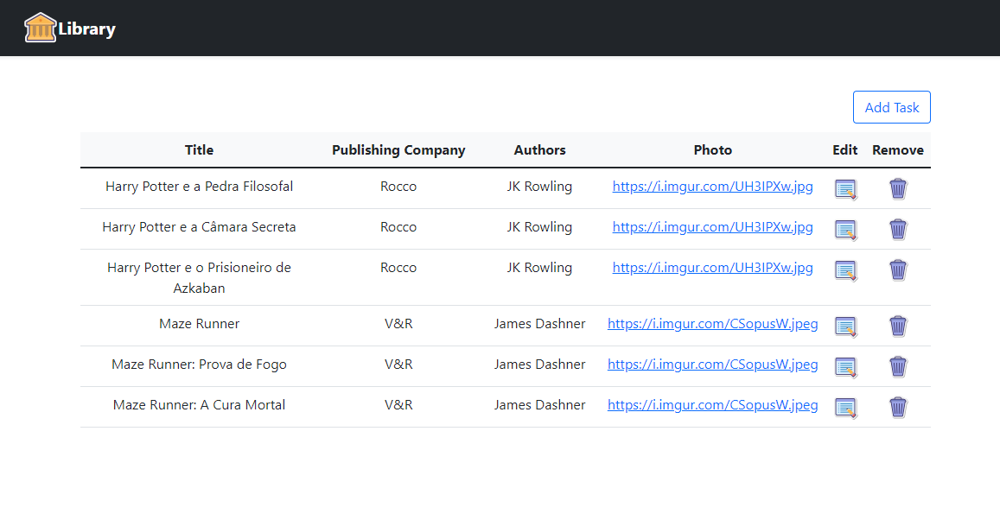

# Consumindo API do [sistema de gerenciamento de uma biblioteca](https://github.com/adkatarine/biblioteca-backend).

### 📋 Pré-requisitos

Primeiro, clone este projeto em sua máquina, crie um ambiente virtual e ative. Feito isso, execute o seguinte comando para instalar todas as suas dependências:

```
pip install -r requirements.txt
```

Caso queira fazer melhorias ou alterações no projeto, execute este comando:
```
pre-commit install
```

Após isso, crie um arquivo .env e insira esta variável com sua respectiva informação:
```
export API_LIBRARY_WORK_URL = 
```

Por fim, siga os passos para executar a [API](https://github.com/adkatarine/biblioteca-backend/blob/master/README.md).


E agora você já pode executar este ultimo comando para iniciar e testar a aplicação:
```
python app.py runserver
```

## 🖨️ Página inicial do projeto




## 🛠️ Estrutura do projeto
```
biblioteca-backend
├── src/
│   ├── __init__.py
│   ├── blueprints/
│   │   ├── __init__.py
│   │   └── library/
│   │       ├── __init__.py
│   │       ├── library.py
│   │       ├── static/
│   │       |   └── library.png
│   │       └── templates/
│   │           ├── base.html
│   │           └── index.html
│   ├── config/
│   │   ├── __init__.py
│   │   └── library_api.py
│   ├── consume_api/
│   │   ├── __init__.py
│   │   └── consume_api_library.py
│   └── helper/
│       ├── __init__.py
│       ├── helper.py
│       └── verify_status_code.py
├── venv/
├── .env
├── .flake8
├── .gitignore
├── .pre-commit-config.yaml
├── .pylintrc
├── .app.py
├── README.md
└── requirements.txt
```

## 🚧 Construído com

Ferramentas utilizadas para o desenvolvimento deste projeto:

* [Flask](https://flask.palletsprojects.com/en/2.0.x/) - Framework
* [Requests](https://docs.python-requests.org/en/latest/) - Biblioteca HTTP Python
* [Pylint](https://pypi.org/project/pylint/) - Ferramenta de análise de código estático do Python
* [Bootstrap](https://getbootstrap.com/docs/5.1/getting-started/introduction/) - Framework